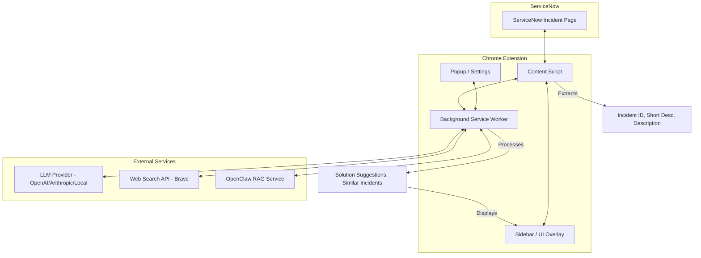

# ServiceNow Agent Architecture



## Component Breakdown

1. **Content Script**:
   - Detects ServiceNow incident forms.
   - Extracts fields: `number`, `short_description`, `description`.
   - Injects an "AI Analysis" button or sidebar.

2. **Background Service Worker**:
   - Manages state and API keys.
   - Routes requests to LLM, Web Search, and RAG.
   - Handles OAuth or API Key authentication securely.

3. **Popup / Options**:
   - UI for configuring API keys (OpenAI, Anthropic).
   - Toggle features (Enable RAG, Enable Web Search).

4. **Integration Layer**:
   - Generic LLM wrapper.
   - Search utility.
   - RAG client.
```
