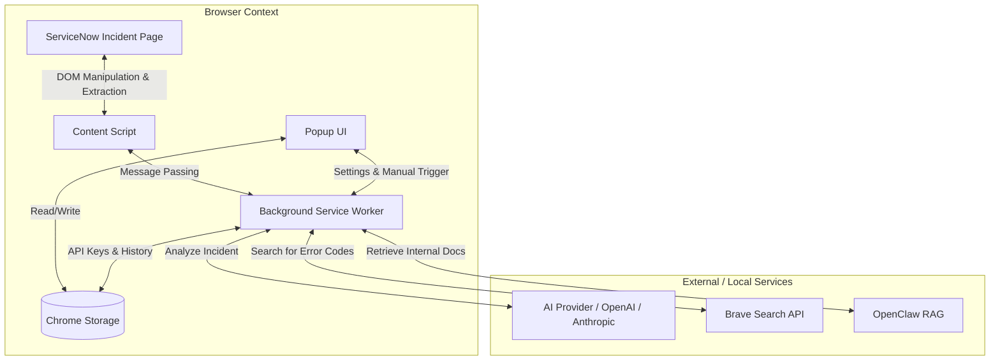

# ServiceNow Agent Architecture

## Overview
The ServiceNow Agent is a Chrome Extension designed to assist Service Desk personnel by analyzing incidents using AI. It integrates with LLMs, Web Search, and local RAG systems.

## Component Diagram

## Functional Flow
1. **Extraction**: Content Script detects an incident page and extracts the Incident Number, Short Description, and Description.
2. **Action**: The user clicks "Analyze with AI" (injected button or popup).
3. **Processing**: The Service Worker gathers context, performs optional Web Search or RAG lookup, and sends the prompt to the LLM.
4. **Presentation**: The solution suggestion is displayed in a sidebar or overlay on the ServiceNow page.

## File Structure Plan
- `manifest.json`: Extension configuration (V3).
- `src/popup/`: Settings UI.
  - `popup.html`
  - `popup.js`
  - `popup.css`
- `src/content/`: Logic running on ServiceNow pages.
  - `content.js`: Extraction and UI injection.
  - `content.css`: Styling for injected elements.
- `src/background/`: Service worker for background tasks.
  - `background.js`: API handling, search, and RAG logic.
- `icons/`: Extension icons.
- `src/lib/`: Shared utilities (API clients, formatting).
